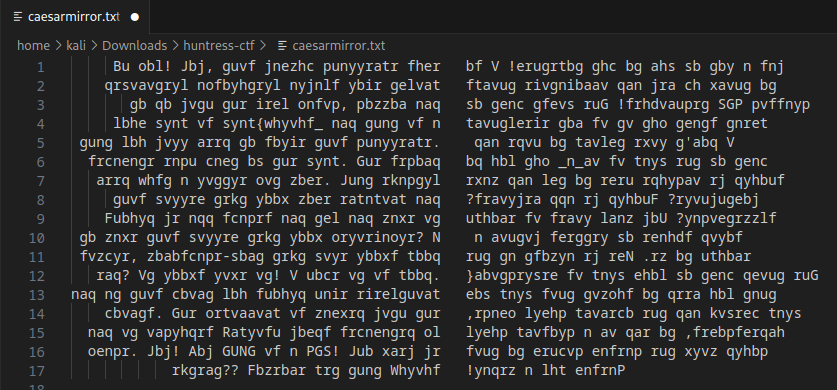

# Huntress CTF - 2023

Team Name: **D2CTF** | Username: **SlowMo7ion**


---

## **WARMUPS Challenges**

### BaseFFFF+1 | 50 points | 10/4/2023


> Maybe you already know about base64, but what if we took it up a notch?
>
> Download the files below. Attachments: [baseffff1](https://huntress.ctf.games/files/4f5b4be19374471dc575e58e9c09637b/baseffff1)

**Solution Walkthrough**

1. Examine the file contents:
    >鹎驣𔔠𓁯噫谠啥鹭鵧啴陨驶𒄠陬驹啤鹷鵴𓈠𒁯ꔠ𐙡啹院驳啳驨驲挮售𖠰筆筆鸠啳樶栵愵欠樵樳昫鸠啳樶栵嘶谠ꍥ啬𐙡𔕹𖥡唬驨驲鸠啳𒁹𓁵鬠陬潧㸍㸍ꍦ鱡汻欱靡驣洸鬰渰汢饣汣根騸饤杦样椶𠌸


2. With the unrecognizable text, let's think back on the challenge title and hint. The hexadecimal value: FFFF corresponds to 65535 in decimal. Adding one to that equals 65536. Is there such thing as base65536?

2. Turns out, there is. [Base65536 Decode Online Tool](https://www.better-converter.com/Encoders-Decoders/Base65536-Decode)
    > base65536 encodes data in a similar fashion to base64, but its alphabet, instead of being 64 characters long, is 65536 characters long. This means, one can map 16 bits of data into a single unicode codepoint.
    >
    > Decoding is much more interesting*. I deviate a little from base64 in the part where I handle non-Base65536-codepoints. as Base65536 does not assign meaning to any single-byte codepoint, those can be placed anywhere inside the encoded string, either for formatting (whitespace, which can also be added automatically by the encoding function) or inserting cleartext messages. Even when having the abort-on-decoding-error enabled, base65536 will not stop when encountering an ASCII (7bit) character. This is meant as a feature.


3. Let's use this tool to decode the message and retrieve the flag

    

<font color="green"> **flag{716abce880f09b7cdc7938eddf273648}** </font>

---
---

#### CaeserMirror | 50 points | 10/5/2023


> Caesar caesar, on the wall, who is the fairest of them all?
>
> Perhaps a clever ROT13?
>
> NOTE: this flag does not follow the usual MD5 hash standard flag format. It is still wrapped with the code>flag{} prefix and suffix.
>
> Download the file(s) below. Attachments: [caesarmirror.txt](https://huntress.ctf.games/files/869c3f4a516cfbfcc05934cd99de357e/caesarmirror.txt)

**Solution Walkthrough**

1. Download and open the file

    


2. Using the hint, let's throw it into CyberChef. 
    * Take the First half of the text and use the ROT13 operation

    )

    * Then take the second half and use the ROT13 and Reverse operations

     )

3. With the message decoded and in the correct order, assemble both halves and grab each piece of the flag from the body of text.

    > Oh boy! Wow, this warmup challenge sure was a lot of fun to put together! I so 
    > definitely absolutely always love trying to think up new and innovative things
    > to do with the very basic, common and classic CTF techniques! The first part of  
    > your flag is `flag{julius_` and that is a great start but it is not everything  
    > that you will need to solve this challenge. I don't like trying to hide and 
    > separate each part of the flag. The second part of the flag is `in_a_` but you do 
    > need just a little bit more. What exactly should we include here to try and make
    > this filler text look more engaging and worthwhile? Should we add newlines? 
    > Should we add spaces and try and make it symmetrical? How many lines is enough 
    > to make this filler text look believable? A solid square of letters within a 
    > simple, monospace-font text file looks good enough to me. Are we almost at the 
    > end? It looks like it! I hope it is good. The third part of your flag is `reflection}` 
    > and at this point you should have everything that you need to submit this flag for 
    > points. The beginning is marked with the flag prefix and the opening curly brace 
    > and it includes English words separated by underscores, to end in a closing curly 
    > brace. Wow! Now THAT is a CTF! Who knew we could milk the caesar cipher to this 
    > extent?? Someone get that Julius Caesar guy a medal!

<font color="green"> **flag{julius_in_a_reflection}** </font>

---

### F12 | 50 points | 10/10/2023


> Remember when Missouri got into hacking!?! You gotta be fast to catch this flag!
> 
> Press the Start button on the top-right to begin this challenge.
> 
> Connect with: http://chal.ctf.games:32522
>
> *Please allow up to 30 seconds for the challenge to become available.*

**Solution Walkthrough**

1. Navigate to the web page and click on the Capture The Flag button. A pop-up window opens, but immediately closes. Let's inspect the source to see if we can learn more about what happens when we click the button.

    

    * *A javascript function `ctf()` appears to open another window to a page called `capture_the_flag.html` when the Capture The Flag button is pushed.*

2. The `capture_the_flag.html` page is in the same directory as the page, so let's append it to our URL.

3. Now we see a button that says `Your flag is:`, but when we click on it nothing happens. Let's inspect the source again to see what it's supposed to do and reveal the flag.

    

    Video Walkthrough:

<font color="green"> **flag{03e8ba07d1584c17e69ac95c341a2569}** </font>

---
---


## **MALWARE Challenges**

### Zerion | 50 points | 10/2/2023


> We observed some odd network traffic, and found this file on our web server... can you find the strange domains that our systems are reaching out to?
>
> NOTE, this challenge is based off of a real malware sample. We have done our best to "defang" the code, but out of abudance of caution it is strongly encouraged you only analyze this inside of a virtual environment separate from any production devices.
>
>Download the file(s) below.
Attachments: [zerion](https://huntress.ctf.games/files/3140c2090a65b4a4810f9090ed72f6e1/zerion


**Solution Walkthrough**
1. Verify the file type with `file`

    

2. Since this looks like it is a php script, let's open the file in a text editor to view the syntax *(truncated output)*

    

3. It looks like script is chaining multiple encodings and patterns together, let's break down each step:

    1. The syntax appears to be reversed *(note the `strrev` function and base64 padding "==" at the beginning of the encoded string)*
    2. The characters are rotated with ROT13 *(`str_rot13`)*
    3. The syntax has been base64 encoded

4. Reverse the order of encoding using [CyberChef](https://gchq.github.io/CyberChef/) to reveal the full syntax and flag.

    

<font color="green"> **flag{af10370d485952897d5183aa09e19883}** </font>

---

### HumanTwo | 50 points | 10/3/2023


> During the MOVEit Transfer exploitation, there were tons of "indicators of compromise" hashes available for the human2.aspx webshell! We collected a lot of them, but they all look very similar... except for very minor differences. Can you find an oddity?
>
> NOTE, this challenge is based off of a real malware sample. We have done our best to "defang" the code, but out of abudance of caution it is strongly encouraged you only analyze this inside of a virtual environment separate from any production devices.
>
> Download the file(s) below. Attachments: [human2.aspx_iocs.zip](https://huntress.ctf.games/files/671ca0608e31fe1e67d84ed9e2c05a09/human2.aspx_iocs.zip
**Solution Walkthrough**

1. Unzip the file contents
    ```bash
    unzip human2.aspx_iocs.zip -d human2.aspx_iocs
    ```

    

2. These filenames look like hashes, let's inspect the contents of a few to see if there are any obvious differences
    * Cycling through a few files in a text editor reveals a slight change on `line 36` for each file

    

3. Now that we have found a change from file to file, we can drill into that further. Let's use `grep` against a common string on line 36 to see if anything else stands out
    ```bash
    grep -r "String.Equals" .   #run from dir containing files
    ```
    
    

    * Nice! We found something different on the `cc53495bb42e4f6563b68cdbdd5e4c2a9119b498b488f53c0f281d751a368f19` file. Let's try to decode the values on this line

4. The strings seem to represent hexadecimal values (containing a-f 0-9 only). Let's use CyberChef with the `From Hex` recipe to decode the text and reveal the flag

    


<font color="green"> **flag{6ce6f6a15dddb0ebb332bfaf2b0b85d1}** </font>

---

### Hot Off The Press | 50 points | 10/3/2023


> Oh wow, a malware analyst shared a sample that I read about in the news!
>
> But it looks like they put it in some weird kind of archive...? Anyway, the password should be **infected** as usual!
>
> NOTE, this challenge is based off of a real malware sample. We have done our best to "defang" the code, but out of abudance of caution it is strongly encouraged you only analyze this inside of a virtual environment separate from any production devices.
>
> In Linux, download the file(s) below. Attachments: [hot_off_the_press](https://huntress.ctf.games/files/4b36d70af4871e3de9ee43f561c2472d/hot_off_the_press

**Solution Walkthrough**

1. Download the `hot_off_the_press` file and inspect what file type it is.
    ```bash
    file hot_off_the_press
    ```
    
    

    * This is a UHarc archive file, so we can use some Windows tools to examine it further We'll move over to Windows for the rest of the challenge

2. In Wndows:
    1. Disable Virus & Threat Protection Settings to avoid issues while extracting the malware sample
    2. Download the `hot_off_the_press` file again and add the `.uha` file extension
    3. Download the [uharc06b](https://www.sac.sk/download/pack/uharc06b.zip) cmd utility and extract the contents of the archive.
    ```PowerShell
    .\uharc06b\UHARC.EXE e -pw .\hot_off_the_press.uha
    ```

    

3. Open the `hot_off_the_press.ps1` file in a text editor to dissect the encoded text. We'll focus on decoding the `base64`, then handle the `gzip` compression.

    

3. Use CyberChef to create the following Recipe to handle the initial encoded string:
    * Remove all non base64 characters 
    * Replace the format string characters: {0} and {1} respectively
    * Convert From Base64
    * Gunzip

4. Use CyberChef again to create another Recipe and reveal the flag
    * Convert From Base64
    * From Hex

        

<font color="green"> **flag{dbfe5f755a898ce5f2088b0892850bf7}** </font>

**Resources:**

* [Cooking Malicious PowerShell Obfuscated Commands with CyberChef](https://www.socinvestigation.com/cooking-malicious-powershell-obfuscated-commands-with-cyberchef/)
* [Base64 Patterns - Learning Aid](https://gist.github.com/Neo23x0/6af876ee72b51676c82a2db8d2cd3639)
* [CyberChef-Recipes](https://github.com/mattnotmax/cyberchef-recipes)

---
---

## **FORENSICS Challenges**

### Traffic | 50 points | 10/4/2023


>We saw some communication to a sketchy site... here's an export of the network traffic. Can you track it down?
>
>Some tools like rita or zeek might help dig through all of this data!
>
>Download the file below. Attachments: [trafic.7z](https://huntress.ctf.games/files/efd8115eedbda53848676208e38e6afc/traffic.7z)

**Solution Walkthrough**

1. Download and unzip the log files into a directory
    ```bash
    wget https://huntress.ctf.games/files/efd8115eedbda53848676208e38e6afc/traffic.7z
    7z x traffic.7z
    mv 2021-09-08 traffic
    ```

2. List out the contents we just unzipped. Following the hints, let's start with the DNS logs to search for a "sketchy site"

    

3. Using zcat to parse the gzipped files, let's look at fields first to better understand column positions within the log, then the first 10 entries in the DNS logs to see how they are structured. We can see from here that dns queries are listed in the 10th field.

    ```bash
    zcat dns.*.log.gz | grep "^#fields" | head -1   #view the fields
    zcat dns.*.log.gz | cut -f 3,5 -d ' ' | sort -u | head -10 #first 10 log entries 
    ```

    

4. Let's focus on the 10th position to isolate DNS hostnames and see if anything jumps out.

    ```bash
    zcat dns.*.log.gz | cut -f 3,5 -d ' ' | awk '{print $10}' | sort | uniq -c | sort -nr
    ```

    

5. At first glance, nothing jumps out. Let's grep for "sketch" based on our hint above.

    ```bash
    zcat dns.*.log.gz | cut -f 3,5 -d ' ' | sort -u | awk '{print $10}' | grep sketch
    ```

    

    * Nice! We found 6 instances to `sketchysite.github.io` let's check it out

6. Visit `sketchysite.github.io` for the flag

    

<font color="green"> **flag{8626fe7dcd8d412a80d0b3f0e36afd4a}** </font>

---
---

## **MISCELLANEOUS Challenges**

### I Wont Let You Down | 50 points | 10/5/2023


> OK Go take a look at this IP:
>
> Connect here: http://155.138.162.158 # USING ANY OTHER TOOL OTHER THAN NMAP WILL DISQUALIFY YOU. DON'T USE BURPSUITE, DON'T USE DIRBUSTER.

**Solution Walkthrough**

1. Let's check out the url in a browser. Yep, it's a Rick-roll! But, we also got a hint to try `nmap`

    


1. Port scan the ip using `nmap`
    ```bash
    nmap -Pn -sT 155.138.162.158 -p- -sV 
    ```

    
    
2. Our scan revealed some services running on non-standard and high port numbers. Since these aren't commonly used, let's banner grabbing with `netcat` to get the flag.
    ```bash
    nc 155.138.162.158 8888
    ```
    
    

    * It's also a Rick-roll, but we also got the flag!


<font color="green"> **flag{93671c2c38ee872508770361ace37b02}** </font>
